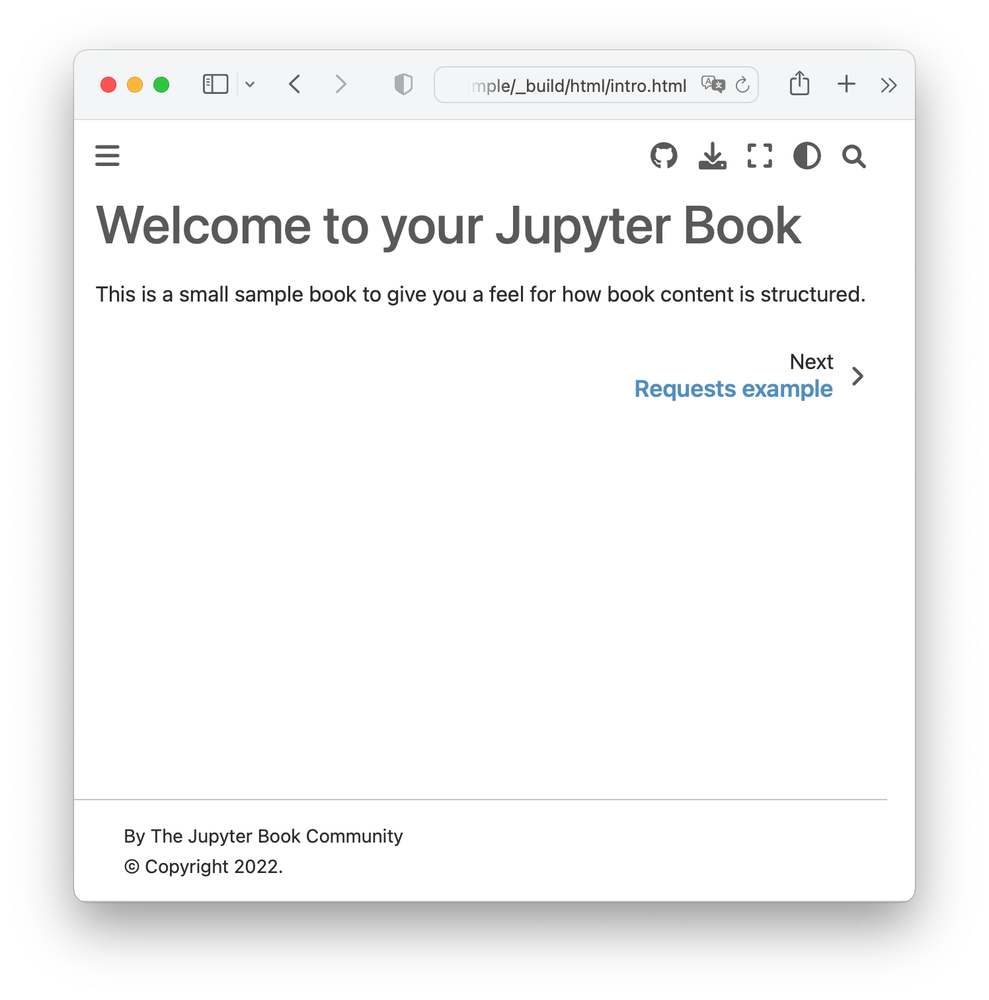
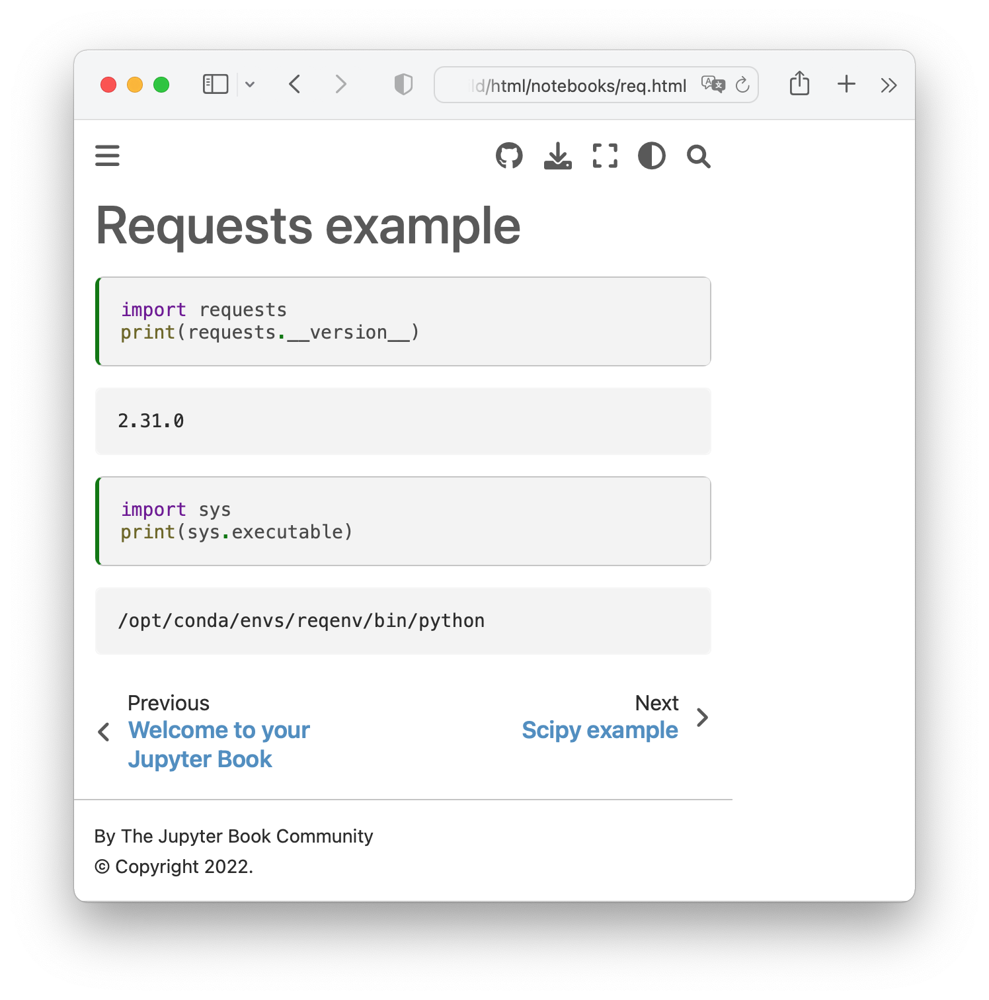
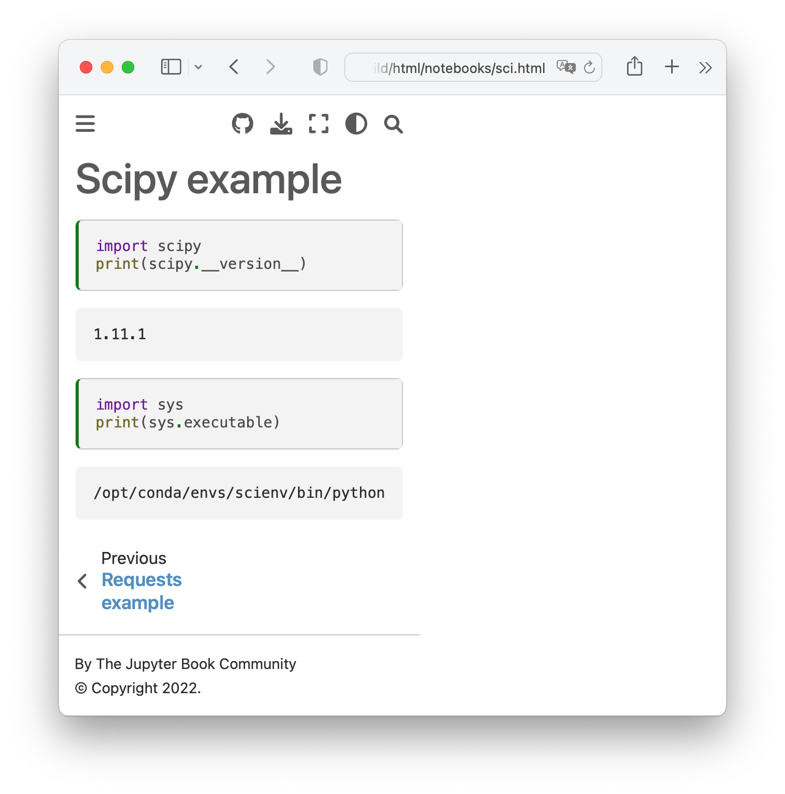

# Example Workflow

To simplify the understanding of the basic workflow we go through, let's use
a generic example.

In the [`example/`](example/) directory, the files we need for this example:

- [`_config.yml`](example/_config.yml): 
    jupyter-book config file;
- [`_toc.yml`](example/_toc.yml): 
    jupyter-book toc file.
- [`intro.md`](example/intro.md): 
    a markdown file with some welcoming message;
- [`notebooks/req.ipynb`](example/notebooks/req.ipynb): 
    a notebook dependent on environment `requests`;
- [`notebooks/sci.ipynb`](example/notebooks/sci.ipynb): 
    a notebook dependent on environment `scipy`;


In `_config.yml`, the modification necessary to our workflow is the control
of the notebooks (results) cache:

```yaml
# See https://jupyterbook.org/content/execute.html
execute:
  execute_notebooks: cache
  cache: .jupyter_cache/
```

This will constrain *jupyter-book* to NOT run the notebooks
but rely on what's in the *cache*.
The cache will be generated by *jupyter-cache* as a first step.


## Notebook environments

The environments `requests` and `scipy`, where the notebooks run, need to have
`ipykernel` installed (besides the required packages):
```bash
conda create -n reqenv -y requests ipykernel
conda create -n scienv -y scipy ipykernel
```

Ipykernel is necessary in every environment because Jupyter-cache effectively
uses Jupyter (kernels) to process the notebooks (when "`jcache project execute`").


### Cache notebooks

Each notebook: we add (to the project), and execute in own environment.

This is the basic workflow with jupyter-cache:

1. Add notebook(s) to the list of notebooks
2. Execute notebook(s) from the list
    - Does *not* re-run notebook(s) already in the cache

Jupyter-cache manages the list of notebooks in directory `.jupyter_cache`,
per default. This is where jupyter-cache and jupyter-book agree in `_config.yml`.

> To create a jupyter-cache database (or *project*) just type any `jcache`
> command and it will ask if you want to create one.
> E.g., inside `/tmp/bla`:
> ```bash
> $ jcache cache list
> Cache path: /tmp/bla/.jupyter_cache
> The cache does not yet exist, do you want to create it? [y/N]: y
> ```


In our example here, let's consider [`example/`](example/) is directly
in our Home (`/home/jovyan/example/`),
```
$ tree
.
├── _config.yml
├── _toc.yml
├── intro.md
└── notebooks
    ├── req.ipynb
    └── sci.ipynb

1 directory, 5 files
```

- Init the project:
    ```bash
    $ jcache cache list
    Cache path: /home/jovyan/example/.jupyter_cache
    The cache does not yet exist, do you want to create it? [y/N]: y
    No Cached Notebooks

    $ jcache notebook list
    No notebooks in project
    ```

- Run-cache one notebook:
    ```bash
    $ conda activate reqenv
    $ python -m ipykernel install --user

    $ jcache notebook add notebooks/req.ipynb
    Adding: /home/jovyan/book/tmp/example/notebooks/req.ipynb
    Success!

    $ jcache notebook list
    ID  URI                          Reader    Added             Status
    ----  ---------------------------  --------  ----------------  --------
    1  example/notebooks/req.ipynb  nbformat  2023-08-05 10:38  -

    $ jcache project execute
    Executing 1 notebook(s) in serial
    Executing: /home/jovyan/book/tmp/example/notebooks/req.ipynb
    Execution Successful: /home/jovyan/example/notebooks/req.ipynb
    Finished! Successfully executed notebooks have been cached.
    succeeded:
    - /home/jovyan/example/notebooks/req.ipynb
    excepted: []
    errored: []

    $ jcache notebook list
    ID  URI                          Reader    Added             Status
    ----  ---------------------------  --------  ----------------  --------
    1  example/notebooks/req.ipynb  nbformat  2023-08-05 10:38  ✅ [1]

    $ # We're done here
    $ conda deactivate
    ```

- Run-cache the other notebook:
    ```bash
    $ conda activate scienv
    $ python -m ipykernel install --user

    $ jcache notebook add notebooks/sci.ipynb 
    Adding: /home/jovyan/example/notebooks/sci.ipynb
    Success!

    $ jcache notebook list
    ID  URI                          Reader    Added             Status
    ----  ---------------------------  --------  ----------------  --------
    1  example/notebooks/req.ipynb  nbformat  2023-08-05 10:38  ✅ [1]
    2  example/notebooks/sci.ipynb  nbformat  2023-08-05 10:48  -

    $ jcache project execute
    Executing 1 notebook(s) in serial
    Executing: /home/jovyan/example/notebooks/sci.ipynb
    Execution Successful: /home/jovyan/example/notebooks/sci.ipynb
    Finished! Successfully executed notebooks have been cached.
    succeeded:
    - /home/jovyan/example/notebooks/sci.ipynb
    excepted: []
    errored: []

    $ jcache notebook list
    ID  URI                          Reader    Added             Status
    ----  ---------------------------  --------  ----------------  --------
    1  example/notebooks/req.ipynb  nbformat  2023-08-05 10:38  ✅ [1]
    2  example/notebooks/sci.ipynb  nbformat  2023-08-05 10:48  ✅ [2]

    $ # We're done here
    $ conda deactivate
    ```

## Build book

Once the notebooks are run and their results cached, we are ready to 
call `jupyter-book` to collect those results and assembly the book.

```bash
$ jupyter-book build -n .

Running Jupyter-Book v0.15.1
Source Folder: /home/jovyan/example
Config Path: /home/jovyan/example/_config.yml
Output Path: /home/jovyan/example/_build/html
Running Sphinx v4.5.0
making output directory... done
[etoc] Changing master_doc to 'intro'
checking bibtex cache... out of date
parsing bibtex file /home/jovyan/example/references.bib... parsed 0 entries
myst v0.18.1: MdParserConfig(commonmark_only=False, gfm_only=False, enable_extensions=['colon_fence', 'dollarmath', 'linkify', 'substitution', 'tasklist'], disable_syntax=[], all_links_external=False, url_schemes=['mailto', 'http', 'https'], ref_domains=None, highlight_code_blocks=True, number_code_blocks=[], title_to_header=False, heading_anchors=None, heading_slug_func=None, footnote_transition=True, words_per_minute=200, sub_delimiters=('{', '}'), linkify_fuzzy_links=True, dmath_allow_labels=True, dmath_allow_space=True, dmath_allow_digits=True, dmath_double_inline=False, update_mathjax=True, mathjax_classes='tex2jax_process|mathjax_process|math|output_area')
myst-nb v0.17.2: NbParserConfig(custom_formats={}, metadata_key='mystnb', cell_metadata_key='mystnb', kernel_rgx_aliases={}, execution_mode='cache', execution_cache_path='.jupyter_cache/', execution_excludepatterns=[], execution_timeout=30, execution_in_temp=False, execution_allow_errors=False, execution_raise_on_error=False, execution_show_tb=False, merge_streams=False, render_plugin='default', remove_code_source=False, remove_code_outputs=False, code_prompt_show='Show code cell {type}', code_prompt_hide='Hide code cell {type}', number_source_lines=False, output_stderr='show', render_text_lexer='myst-ansi', render_error_lexer='ipythontb', render_image_options={}, render_figure_options={}, render_markdown_format='commonmark', output_folder='build', append_css=True, metadata_to_fm=False)
Using jupyter-cache at: .jupyter_cache/
building [mo]: targets for 0 po files that are out of date
building [html]: targets for 5 source files that are out of date
updating environment: [new config] 5 added, 0 changed, 0 removed
/home/jovyan/example/.jupyter_cache/executed/ac6d55eddb80d69b7a443ed30aa05ddc/base.ipynb: Using cached notebook: ID=1 [mystnb]
/home/jovyan/example/.jupyter_cache/executed/bd2bc6fa0583cc2784133123a328e603/base.ipynb: Using cached notebook: ID=2 [mystnb]
/home/jovyan/example/notebooks/req.ipynb: Using cached notebook: ID=1 [mystnb]                                        
/home/jovyan/example/notebooks/sci.ipynb: Using cached notebook: ID=2 [mystnb]                                        

looking for now-outdated files... none found
pickling environment... done
checking consistency... /home/jovyan/example/.jupyter_cache/executed/ac6d55eddb80d69b7a443ed30aa05ddc/base.ipynb: WARNING: document isn't included in any toctree
/home/jovyan/example/.jupyter_cache/executed/bd2bc6fa0583cc2784133123a328e603/base.ipynb: WARNING: document isn't included in any toctree
done
preparing documents... done
writing output... [100%] notebooks/sci                                                                                                                                     
generating indices... genindex done
writing additional pages... search done
copying static files... done
copying extra files... done
dumping search index in English (code: en)... done
dumping object inventory... done
build succeeded, 2 warnings.

The HTML pages are in _build/html.
[etoc] missing index.html written as redirect to 'intro.html'

===============================================================================

Finished generating HTML for book.
Your book's HTML pages are here:
    _build/html/
You can look at your book by opening this file in a browser:
    _build/html/index.html
Or paste this line directly into your browser bar:
    file:///home/jovyan/example/_build/html/index.html            

===============================================================================

```
The `build succeeded`.
We see there are some *warnings* about files not being in the _toc_ which 
we can safelly ignore, they are harmless (it's a bug, I guess, that I should report). 

We should be able to see the results of our book in the location provided
to us (`file:///home/jovyan/example/_build/html/index.html`):




