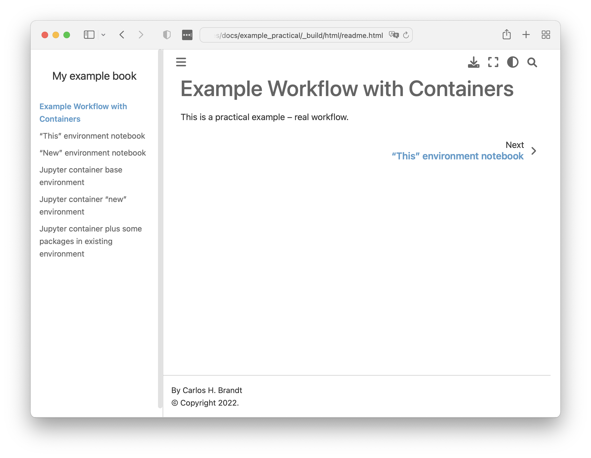

# Practical Workflow Example

Now let's consider a more complex scenario, one that covers the use of
environments inside and outside containers, likely to be a scenario in
our material.

## Software requirements

To run this example, you'll need:

- [Jupyter-Book](https://jupyter-book.org) (which includes Jupyter-Cache)
- [Conda](https://docs.conda.io/projects/conda/) (or Anaconda)
- [Docker](https://www.docker.com)

We recommend installing Jupyter-Book in a separate environment, like so:

```bash
conda create -n jupyter-book -y python pip jupyter-book
```

## Book content

Directory [`example_practical/`](example_practical/) is our work-directory
for this example. The notebooks in there contain some code cells enough to
test and show the different environments and workflow at hand.

The following notebooks are going to compose our book:

- `this_env.ipynb`: uses the same environment as jupyter-book.
- `new_env.ipynb`: demands a different (conda) environment, defined in
`new_env.yml`.
- `container_base_env.ipynb`: runs in a jupyter container,
using the *base* environment.
- `container_new_env.ipynb`: runs in a jupyter container, in
an environment defined in `container_new_env.yml`.
- `packages_container_base_env.ipynb`: runs in a container, uses the
*base* environment but install packages listed in `packages_container_base_env.txt`.

In our workflow (below), we first run the notebooks (with Jupyter-Cache)
and only *then* we call Jupyter-Book to assemble the notebooks into a
book according to `_toc.yml` and `_config.yml`. Jupyter-Book will also
process Markdown files, here, `readme.md`.

> [!IMPORTANT]
> Have a look in [Contributors' "Caveats" section](contributors.md) for
> important notes of this workflow and the tools we're using.
>
> For instance, you'll notice the use of [jq](https://jqlang.github.io/jq/)
> tool in this example *to remove `kernelspec` information from the notebooks*:
>
> ```json
>  "kernelspec": {
>   "display_name": "Python 3 (ipykernel)",
>   "language": "python",
>   "name": "python3"
>  },
> ```
>
> If you don't want or can't install *jq*, you can handle that with other
> tools or even manually; no worries.
> If you're reproducing this workflow and you happend to have errors
> regarding the "unknown kernel XYZ", it's *probably* because "XYZ" is
> hardcoded in your notebook (in the `kernelspec`), and you can safely
> remove such info with:
>
> ```bash
> $ # First, we have to remove metadata associated to kernel (jupyter-lab does this)
> $ jq 'del(.metadata.kernelspec)' the_notebook.ipynb > tmp.ipynb
> $ mv tmp.ipynb the_notebook.ipynb
> ```

## Jupyter Notebooks run/cache

Use the `jupyter-book` environment we created before for the workflow:

```bash
conda activate jupyter-book
```

1. Run `this_env.ipynb`

    ```bash
    $ jcache notebook add this_env.ipynb

    Cache path: /planetary_data_stories/docs/example_practical/.jupyter_cache
    The cache does not yet exist, do you want to create it? [y/N]: y
    Adding: /planetary_data_stories/docs/example_practical/this_env.ipynb
    Success!

    $ jcache project execute

    Executing 1 notebook(s) in serial
    Executing: /planetary_data_stories/docs/example_practical/this_env.ipynb
    Execution Successful: /planetary_data_stories/docs/example_practical/this_env.ipynb
    Finished! Successfully executed notebooks have been cached.
    succeeded:
    - /planetary_data_stories/docs/example_practical/this_env.ipynb
    excepted: []
    errored: []
    ```

1. Run `new_env.ipynb`

    ```bash
    $ conda env create -f new_env.yml -n 'new_env'
    (...)
    Preparing transaction: done
    Verifying transaction: done
    Executing transaction: done
    #
    # To activate this environment, use
    #
    #     $ conda activate new_env
    #
    # To deactivate an active environment, use
    #
    #     $ conda deactivate

    $ conda activate --stack 'new_env'

    $ pip install ipykernel
    Installing collected packages: ...
    Successfully installed ...

    $ python -m ipykernel install --user --name 'new_env'
    Installed kernelspec new_env in /Users/chbrandt/Library/Jupyter/kernels/new_env

    $ jcache notebook add new_env.ipynb
    Adding: /planetary_data_stories/docs/example_practical/new_env.ipynb
    Success!

    $ jcache notebook list
      ID  URI                                    Reader    Added             Status
    ----  -------------------------------------  --------  ----------------  --------
       1  docs/example_practical/this_env.ipynb  nbformat  2023-08-15 13:01  ✅ [1]
       2  docs/example_practical/new_env.ipynb   nbformat  2023-08-15 13:31  -

    $ jcache project execute
    Executing 1 notebook(s) in serial
    Executing: /planetary_data_stories/docs/example_practical/new_env.ipynb
    Execution Successful: /planetary_data_stories/docs/example_practical/new_env.ipynb
    Finished! Successfully executed notebooks have been cached.
    succeeded:
    - /planetary_data_stories/docs/example_practical/new_env.ipynb
    excepted: []
    errored: []

    $ conda deactivate
    ```

1. Run `container_base_env.ipynb`

    ```bash
    $ docker run -d --rm --name 'jupmin' -v "$PWD":"$PWD" 'jupyter/minimal-notebook'
    92c5f98c1b533

    $ docker exec -t -w "$PWD" 'jupmin' bash -ic "pip install jupyter-cache"
    Successfully installed click-8.1.6 jupyter-cache-0.6.1 nbclient-0.7.4 tabulate-0.9.0

    $ # FIRST CLEAN METADATA (kernelspec) from notebook
    $ jq 'del(.metadata.kernelspec)' container_base_env.ipynb > tmp.ipynb
    $ mv tmp.ipynb container_base_env.ipynb

    $ docker exec -t -w "$PWD" 'jupmin' bash -ic "conda activate 'base' \
        && jcache notebook add 'container_base_env.ipynb' \
        && jcache project execute"

    $ docker stop 'jupmin'
    jupmin
    ```

1. Run `container_new_env.ipynb`

    ```bash
    $ # First, we have to remove metadata associated to kernel (jupyter-lab does this)
    $ jq 'del(.metadata.kernelspec)' container_new_env.ipynb > tmp.ipynb
    $ mv tmp.ipynb container_new_env.ipynb

    $ docker run -d --rm --name 'jupmin' -v "$PWD":"$PWD" 'jupyter/minimal-notebook'
    1a5dd6f089fc2

    $ docker exec -t 'jupmin' bash -ic \
        "conda env create -n 'tmp' -f $PWD/container_new_env.yml"

    $ docker exec -t 'jupmin' bash -ic \
        "conda activate 'tmp' \
        && pip install jupyter-cache ipykernel \
        && python -m ipykernel install --user --name 'tmp'"

    $ docker exec -t -w "$PWD" 'jupmin' bash -ic \
        "conda activate 'tmp' \
        && jcache notebook add 'container_new_env.ipynb' \
        && jcache project execute"

    $ docker stop 'jupmin'
    jupmin
    ```

1. Run `packages_container_base_env.ipynb`

    ```bash
    $ # First, we have to remove metadata associated to kernel (jupyter-lab does this)
    $ jq 'del(.metadata.kernelspec)' packages_container_base_env.ipynb > tmp.ipynb
    $ mv tmp.ipynb packages_container_base_env.ipynb

    $ docker run -d --rm --name 'jupmin' -v "$PWD":"$PWD" 'jupyter/minimal-notebook'
    6d8231be7c773

    $ docker exec -t 'jupmin' bash -ic \
        "conda activate 'base' && pip install jupyter-cache"
    (...)
    Successfully installed jupyter-cache-0.6.1 ...

    $ docker exec -t 'jupmin' bash -ic \
        "conda activate base \
        && python -m pip install -r $PWD/packages_container_base_env.txt"
    (...)
    Successfully installed sh-2.0.6

    $ docker exec -t -w "$PWD" 'jupmin' bash -ic \
        "conda activate 'base' \
        && jcache notebook add packages_container_base_env.ipynb \
        && jcache project execute"
    Adding: /planetary_data_stories/docs/example_practical/packages_container_base_env.ipynb
    Success!
    Executing 1 notebook(s) in serial
    Executing: /planetary_data_stories/docs/example_practical/packages_container_base_env.ipynb
    Execution Successful: /planetary_data_stories/docs/example_practical/packages_container_base_env.ipynb
    Finished! Successfully executed notebooks have been cached.
    succeeded:
    - /planetary_data_stories/docs/example_practical/packages_container_base_env.ipynb
    excepted: []
    errored: []

    $ docker stop 'jupmin'
    jupmin
    ```

## Jupyter Book build

Now that we have all notebooks (results) cached, it's time to ask
Jupyter-Book to bring them together into the book structure we have defined
in `_toc.yml`:

At this point we have in our `example_practical` folder:

```bash
$ ls -1a
.
..
.jupyter_cache
_config.yml
_toc.yml
container_base_env.ipynb
container_new_env.ipynb
container_new_env.yml
new_env.ipynb
new_env.yml
packages_container_base_env.ipynb
packages_container_base_env.txt
readme.md
this_env.ipynb
```

Build the book:

```bash
$ jupyter-book build .
Running Jupyter-Book v0.15.1
Source Folder: /planetary_data_stories/docs/example_practical
Config Path: /planetary_data_stories/docs/example_practical/_config.yml
Output Path: /planetary_data_stories/docs/example_practical/_build/html
Running Sphinx v4.5.0
[etoc] Changing master_doc to 'readme'
loading pickled environment... done
myst v0.18.1: MdParserConfig(commonmark_only=False, gfm_only=False, enable_extensions=['colon_fence', 'dollarmath', 'linkify', 'substitution', 'tasklist'], disable_syntax=[], all_links_external=False, url_schemes=['mailto', 'http', 'https'], ref_domains=None, highlight_code_blocks=True, number_code_blocks=[], title_to_header=False, heading_anchors=None, heading_slug_func=None, footnote_transition=True, words_per_minute=200, sub_delimiters=('{', '}'), linkify_fuzzy_links=True, dmath_allow_labels=True, dmath_allow_space=True, dmath_allow_digits=True, dmath_double_inline=False, update_mathjax=True, mathjax_classes='tex2jax_process|mathjax_process|math|output_area')
myst-nb v0.17.2: NbParserConfig(custom_formats={}, metadata_key='mystnb', cell_metadata_key='mystnb', kernel_rgx_aliases={}, execution_mode='cache', execution_cache_path='.jupyter_cache/', execution_excludepatterns=[], execution_timeout=30, execution_in_temp=False, execution_allow_errors=False, execution_raise_on_error=False, execution_show_tb=False, merge_streams=False, render_plugin='default', remove_code_source=False, remove_code_outputs=False, code_prompt_show='Show code cell {type}', code_prompt_hide='Hide code cell {type}', number_source_lines=False, output_stderr='show', render_text_lexer='myst-ansi', render_error_lexer='ipythontb', render_image_options={}, render_figure_options={}, render_markdown_format='commonmark', output_folder='build', append_css=True, metadata_to_fm=False)
Using jupyter-cache at: .jupyter_cache/
building [mo]: targets for 0 po files that are out of date
building [html]: targets for 0 source files that are out of date
updating environment: 0 added, 1 changed, 0 removed
reading sources... [100%] readme
looking for now-outdated files... none found
pickling environment... done
checking consistency... /planetary_data_stories/docs/example_practical/.jupyter_cache/executed/3cceab471a11b7f29cde2085da47a613/base.ipynb: WARNING: document isn't included in any toctree
/planetary_data_stories/docs/example_practical/.jupyter_cache/executed/bcf649d844976a197881c487af7c7779/base.ipynb: WARNING: document isn't included in any toctree
/planetary_data_stories/docs/example_practical/.jupyter_cache/executed/cc29605fa0e3df9b81e99a087f77253f/base.ipynb: WARNING: document isn't included in any toctree
/planetary_data_stories/docs/example_practical/.jupyter_cache/executed/ce6f7ddcb08d62c0319d05226c3302c0/base.ipynb: WARNING: document isn't included in any toctree
/planetary_data_stories/docs/example_practical/.jupyter_cache/executed/e7dbb98078e6aee188970092849ea991/base.ipynb: WARNING: document isn't included in any toctree
done
preparing documents... done
writing output... [100%] readme
generating indices... genindex done
writing additional pages... search done
copying static files... done
copying extra files... done
dumping search index in English (code: en)... done
dumping object inventory... done
build succeeded, 5 warnings.

The HTML pages are in _build/html.

===============================================================================

Finished generating HTML for book.
Your book's HTML pages are here:
    _build/html/
You can look at your book by opening this file in a browser:
    _build/html/index.html
Or paste this line directly into your browser bar:
    file:///planetary_data_stories/docs/example_practical/_build/html/index.html

===============================================================================
```

We open the URL provided and we have our example book:



> For convenience, I'm including the HTML pages in:
>
> - [assets/book_build/html/](assets/book_build/html/)
